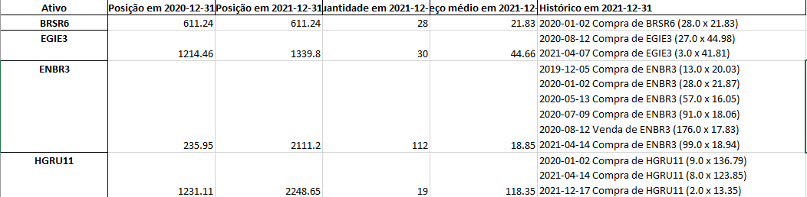

# Consolidação de extratos do CEI para imposto de renda (IRPF)


Este script visa facilitar a declaração do imposto de renda da pessoa física (IRPF), através da consolidação dos extratos gerados pelo Canal Eletrônico do Investidor (CEI), da B3. Com geração automática de reports como declaração de bens e posição na data desejada, deixar suas Ações, Opções e FIIs em dia com o leão fica muito mais fácil. O script também retorna um histórico de toda as compras e vendas do ativo, para acompanhamento e discriminação de maneira simples.


### Importante! (21/05/2022)

Esse Script passou por profunda refatoração visando adequação com o novo padrão de origem dos dados vindo da B3. Portanto, algumas funcionalidades não foram migradas (Oções).


### Requisitos:

1) Instalação do Python [Python 3.7.x](https://www.python.org)

Disponibilizamos um arquivo de requirements com todas as (poucas) dependencias do projeto.
Para instalar as dependencias, primeiro recomendamos a criação de um [ambiente virtual](https://docs.python.org/pt-br/3/tutorial/venv.html) (opcional). Depois, abra um terminal na pasta do projeto e digite o comando:

```
pip install -r requirements.txt
```

### Preparo:
Os extratos de negociação do [CEI](https://www.investidor.b3.com.br) (Extratos -> Movimentação -> Filtrar por movimentações durante o ano de  interesse selecionando dias uteis para inicio e fim) devem estar em formato excel, localizados na pasta `movimentacoes`. Não deve haver sobreposição entre as datas dos arquivos, isto é, dados da mesma transição que se encontrem em dois arquivos diferentes serão considerados como duas transações iguais. A recomendação é que se gere um único arquivo por ano/corretora, de 1º de Janeiro a 31 de Dezembro.


### Modo de uso:
No momento, há dois modos de uso possíveis:

- Geração de relatório de posição em data à escolha.
```
python process_transactions.py --posicao yyyy-mm-dd
```

- Geração de relatório de posição no ano base do imposto de renda e no ano anterior (para a declaração de bens e direitos). Esta planilha também inclui o lucro/prejuízo realizado mensalmente, no ano base.
```
python process_transactions.py --declaracao yyyy
```

Adicionalmente, pode-se criar uma planilha consolidando todos os extratos em um único arquivo:
```
python consolidate_cei.py
```

Caso os extratos mensais estejam disponíveis, a consolidação de proventos é feita pelo comando:
```python
python consolidate_earnings.py
```
O resultado será salvo na planilha `consolidado_proventos.xslx`, contendo 6 abas. Para os proventos provisionados e creditados, há uma aba com a lista completa, uma com o valor agregado mensalmente e por último uma com agragação por ativo. Infelizmente, o CEI não diferencia Dividendos (Isentos de Imposto) de JSCP (alíquota de 15%, descontada na fonte), de forma que esta planilha serve apenas para conferência, e não como fonte de dados para a declaração.

#### Exemplo de uso:
Na pasta `extratos_cei` se encontram duas planilhas, `movimentacao_2021.xls` e `movimentacao_2020.xls`. O conteúdo destas planilhas pode ser visto abaixo:

**movimentacao_2021.xls**<br>


**movimentacao_2021.xls**<br>


Ao rodar o comando
```
python process_transactions.py --posicao 2022-01-01
```
o script nos dá todas as negociações feitas e a posição até no dia 01/01/2022. Estas informaçoes ficam salvas na planilha `posicoes_2022-01-01.xlsx`, que pode ser vista abaixo:

**posicoes_2022-01-01.xlsx**<br>


Rodando o comando
```
python process_transactions.py --declaracao 2022
```
o script consolida informações compra e venda de ações para imposto de renda, nos dando todas as posições em 31 de dezembro de 2021 e de 2022, e também o lucro/prejuízo realizado a cada mês, em diferentes abas. Estas informaçoes ficam salvas na planilha `declaracao_2022.xlsx`, que pode ser vista abaixo:

**declaracao_2022.xlsx -> Declaração de bens**<br>


**declaracao_2022.xlsx -> Lucro Realizado**<br>


### Bonificação em Ações (Novidade):

Os scripts foram atualizados para considerar as bonificações em ações na declaração do preço médio.
Para que assim seja computado, deve-se preencher o preço médio das ações bonificações nas planilhas de movimentação conforme exemplo abaixo. O preço médio de cada evento de bonificação pode ser encontrado nos anuncios oficiais das respectivas empresas.

**Bonificação em Ações**<br>


Obs: a bonificação também deve ser declarada na seção "Rendimentos Isentos e Não Tributáveis".

### Dividendos (Novidade):

Agora também é possivel realizar a consolidação dos proventos recebidos por empresa, e separados entre Proventos e Juros Sobre Capital Próprio.

Rodando o comando
```
python consolidate_earnings
```

O resultado será realizado na planilha `consolidado_proventos.xlsx`.

**Proventos e Juros Sobre Capital Próprio**<br>


### Atenção!
Atualmente, o script não processa as seguintes informações:

- Opções
- Exercicio de opções


Após refatoração para o novo padrão dos dados vindo da B3, todas as funcionalidades referentes a opções foram desligadas. Sintam-se convidados a contribuir diretamente nesse item.


### Colaboração

Pull requests com melhorias e novas funcionalidades são sempre bem vindos!
